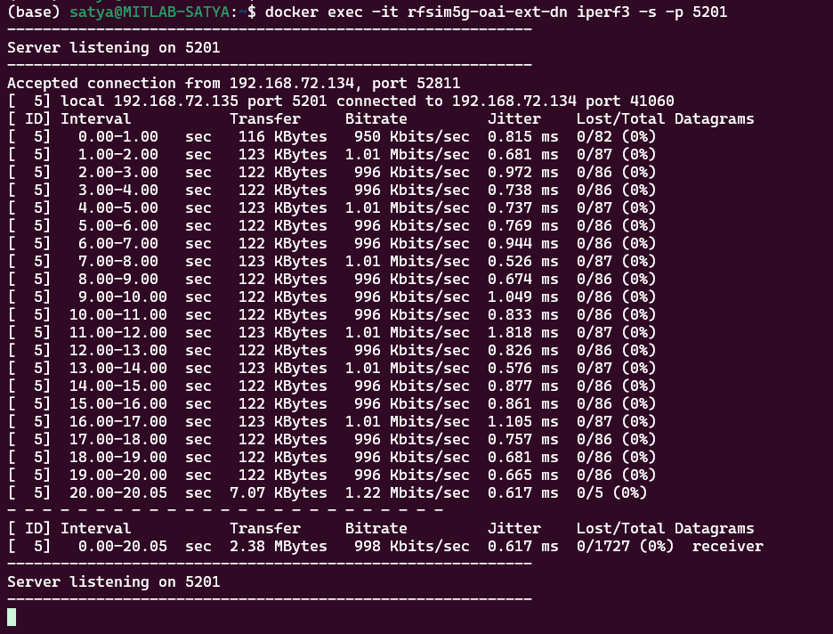
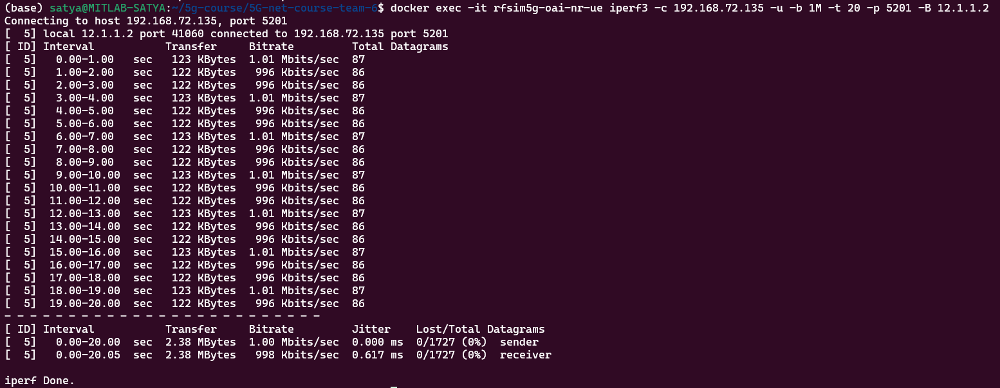
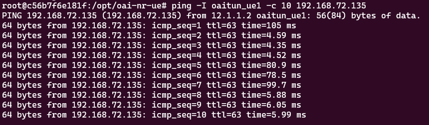

# 5G Healthcare Simulation with OAI RF Simulator
This guide provides a comprehensive walkthrough to deploy, simulate, and evaluate a fully virtualized 5G Standalone (SA) network using the OpenAirInterface (OAI) RF simulator. It’s tailored for a healthcare IoT scenario where wearable sensors (UEs) send real‑time patient data over a 5G network to a backend server—all in Docker containers.

## 1. Project Overview

- **Objective**: Showcase end-to-end 5G SA connectivity in a healthcare context, focusing on ultra‑low latency and reliability for wearable IoT devices.
- **Components**:
   - RF Simulator: Virtual radio link—no SDR hardware required.
   - gNB: OAI 5G base station container.
   - CN5G: Core Network containers (MySQL, AMF, SMF, UPF).
   - UE: Three nrUE containers simulating wearable devices.
   - DN: External Data Network container running the healthcare application server.

Below is the logical topology and IP addressing for our Docker-based RF simulator deployment:

- Private Subnet (192.168.71.128/26): Hosts UE, gNB, AMF, SMF, UPF—isolated traffic between RAN and Core.
- Public Subnet (192.168.72.128/26): Hosts NRF and ext-dn, with ext-dn providing connectivity to the “internet” (SGI).
- SGI Route: On ext-dn host, a route to UE data network 12.1.1.0/24 is added via the Core (192.168.72.134 interface).
- IP Assignment: Default compose file provides static IPs per container as shown above.

## 2. Test Scenario
We emulate three wearable sensors (e.g., heart‑rate monitors) connecting over 5G:
```
[ UE #1, #2, #3 ] <--(RF Simulator)--> [ OAI gNB ] <--(NGAP/SCTP)--> [ CN5G ] <--(GTP‑U)--> [ Healthcare App Server ]
```
All components run as Docker containers on a single host using OAI’s RF simulator for the radio interface.
- **UE**: Dockerized nrUE process simulating wearable sensors.
- **gNB**: Dockerized OAI softmodem providing simulated RF and NG interfaces.
- **Core**: Dockerized CN5G containers (AMF, SMF, UPF).
- **Server**: Health monitoring service receiving sensor data over the 5G data network.

## 3. Goals
**1. Latency:** Measure end-to-end round‑trip latency; target < 20 ms for reliable real‑time monitoring.
**2. Connectivity:** Verify UE registration, PDU session establishment, and stable packet exchange.
**3. Throughput & Reliability:** Use iperf3 to validate throughput and jitter under a realistic UDP load.

## 4. Prerequisites
**- Software:** Git, Docker Engine, Docker Compose V2, wireshark/tshark, iperf3, netcat
**- Network:** Docker bridge (default) or host networking for cross-container setups

## 5. Environment Setup

### 5.1. Install Docker & Compose
```bash
sudo apt update
sudo apt install -y docker.io docker-compose-plugin git curl net-tools
sudo usermod -aG docker $USER && newgrp docker
```

### 5.2. Clone OAI Repository
```bash
git clone https://gitlab.eurecom.fr/oai/openairinterface5g.git ~/openairinterface5g
cd ~/openairinterface5g
```

### 5.3. Pull Prebuilt Images
```bash
docker pull mysql:8.0
docker pull oaisoftwarealliance/oai-amf:v2.1.9
docker pull oaisoftwarealliance/oai-smf:v2.1.9
docker pull oaisoftwarealliance/oai-upf:v2.1.9
docker pull oaisoftwarealliance/trf-gen-cn5g:focal
```

### D. Build Our Own gNB and nrUE Image
```bash
docker build --target ran-base --tag ran-base:latest --file docker/Dockerfile.base.ubuntu22 .
docker build --target ran-build --tag ran-build:latest --file docker/Dockerfile.build.ubuntu22 .

docker build --target oai-enb --tag oai-enb:latest --file docker/Dockerfile.eNB.ubuntu22 .
docker build --target oai-nr-ue --tag oai-nr-ue:latest --file docker/Dockerfile.nrUE.ubuntu22 .
```

## 6. Deployment
> **Note:** Launch services in sequence; wait for each to be healthy before proceeding.

### 6.1. Core Network
```bash
cd ~/openairinterface5g/ci-scripts/yaml_files/5g_rfsimulator
docker-compose up -d mysql oai-amf oai-smf oai-upf oai-ext-dn
```
Use `docker compose ps` to verify.

### 6.2. gNB (RAN)
```bash
docker compose up -d oai-gnb
```
Check `docker logs -f oai-amf --follow` for a successful NGAP connection from the gNB.

### 6.3. UEs (Wearable Devices)
On another terminal:
```bash
docker compose up -d oai-nr-ue oai-nr-ue2 oai-nr-ue3
```
Monitor AMF logs for each UE’s registration procedure.

### 6.4. Verification
```bash
# From UE container:
docker exec -it rfsim5g-oai-nr-ue ping -I oaitun_ue1 192.168.72.135
```
A successful ping confirms data-plane connectivity.

## 7. Healthcare Data Flow Simulation
7.1. **Simulate Sensor Data (UE ➡️ Server)**
   ```bash
   docker exec -it rfsim5g-oai-nr-ue bash -c \
  "while true; do echo \"HR:$((60 + RANDOM % 40))\" | nc -u 192.168.72.135 5000; sleep 5; done"
   ```
   `192.168.72.135` is the ext-dn container’s IP.
7.2. **Receive Data (Server)**
   ```bash
   docker exec -it rfsim5g-oai-ext-dn nc -u -l 5000
   ```
7.3. **Scale UEs:** Add more oai-nr-ue-X services in the compose file and matching IMSI entries in the Core's database.

## 8. Testing Methodology
To evaluate uplink performance (UE → Server), we focus on packet capture for latency analysis and iperf3 UDP tests for throughput and jitter.

### 8.1 Packet Capture (Wireshark/tshark)
Capture GTP‑U and SCTP traffic on the UE tunnel interface to measure packet-level latency:
```bash
# On the host, identify the UE container's network interface (oaitun_ue1)
tshark -i oaitun_ue1 -f "udp port 2152 or sctp port 38412" -w latency_uplink.pcap
```
Analyze the resulting pcap in Wireshark to timestamp UDP data packets and their responses, deriving uplink RTT.

### 8.2 Uplink Throughput & Jitter (iperf3)
Simulate a wearable sensor pushing UDP traffic to the backend (ext-dn at 192.168.72.135):
1. Start the iperf3 server inside the ext-dn container
```bash
docker exec -it rfsim5g-oai-ext-dn iperf3 -s -p 5201
```
2. Run the iperf3 client inside an nrUE container
```bash
docker exec -it rfsim5g-oai-nr-ue iperf3 -c 192.168.72.135 -u -b 1M -t 20 -p 5201
```

## 9. Latency Measurement and Results
Using the above methods, we can analyze the network's latency performance. Below are the outcome of these tests: 
| Metric | Value (ms) |
| -------- | ------- |
Total Data Sent | 2.38 MB |
Bandwidth | 998 Kbits/sec |
Average Jitter | 0.617 ms |
Packet Loss | 0/1 727 (0 %) |


_Server-side iperf3 report showing jitter and packet counts._


_Client-side iperf3 output showing throughput over each interval._
**Analysis**: Throughput is close to the offered load (1 Mbps), with negligible packet loss and sub-millisecond jitter, demonstrating stable uplink performance for a wearable IoT sensor.

<!-- ### 9.1 Control-plane Latency (ICMP Ping) Control-plane Latency (ICMP Ping)
We measure ICMP RTT from an nrUE container to the external data network over the 5G control-plane tunnel:
```bash
# From inside an UE container:
ping -I oaitun_ue1 -c 10 192.168.72.135
# Example summary after removing initial attach delay:
rtt min/avg/max/mdev = 4.350/5.100/6.050/0.650 ms
```

Ping output after initial registration—values reflect subsequent RTT once the PDU session is established.
Analysis: After the first packet incurs registration and ARP overhead, the following control-plane RTTs stabilize around 5 ms, well within the < 10 ms target of 5G for ultra-reliable, low-latency applications. -->

## 10. Cleanup
```bash
docker compose down
```
Removes containers, networks, and volumes created by Docker Compose.

## 11. References
- OAI Docker deployment: https://gitlab.eurecom.fr/oai/openairinterface5g/-/tree/develop/docker
- 5G RF Simulator CI scripts: https://gitlab.eurecom.fr/oai/openairinterface5g/-/blob/develop/ci-scripts/yaml_files/5g_rfsimulator/README.md